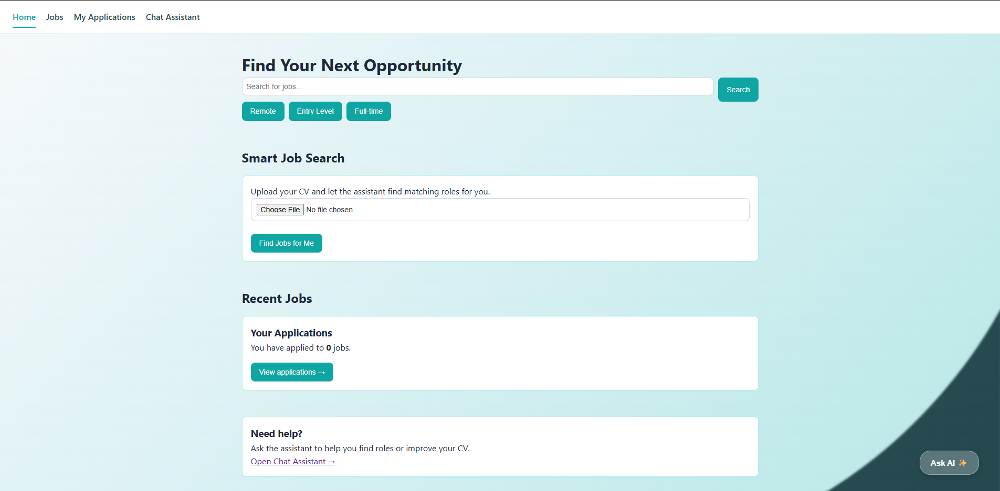
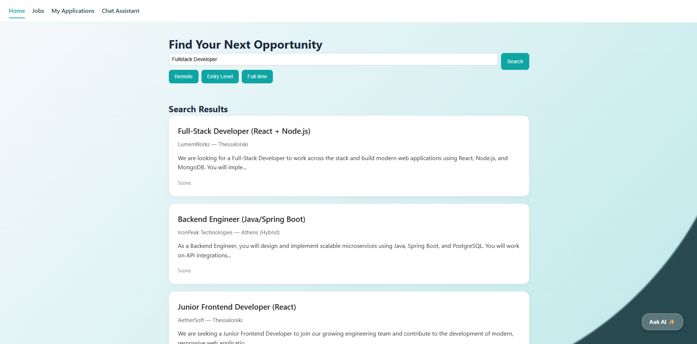
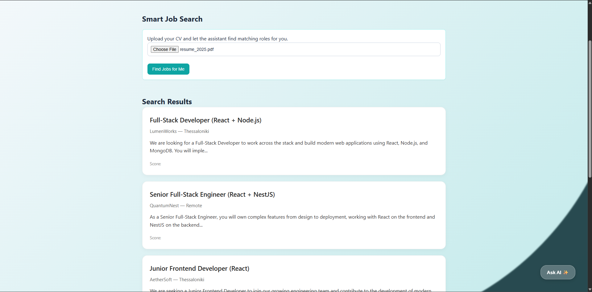
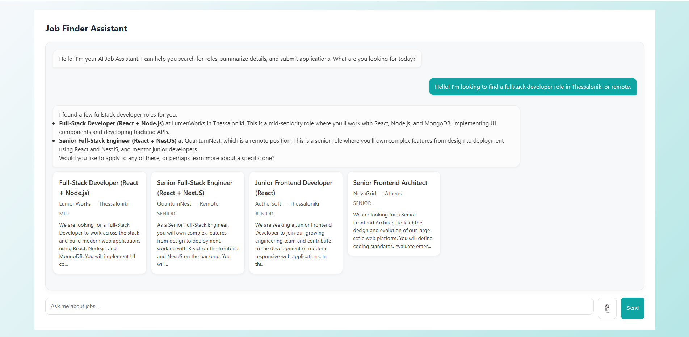
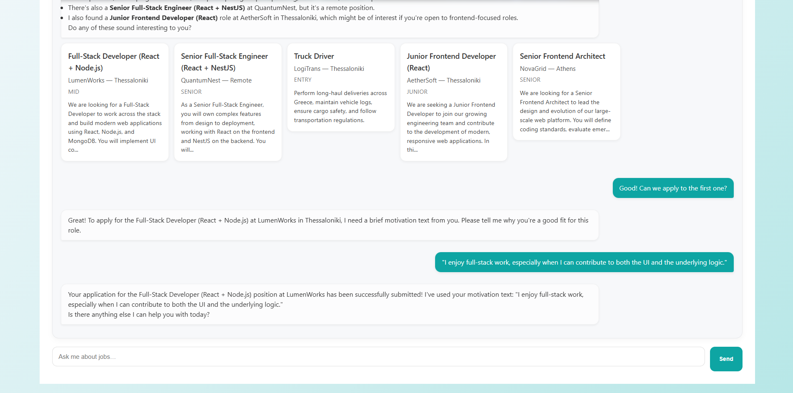

# Project JobfinderAI — Prototype

This repository contains an end‑to‑end prototype exploring **semantic search**, **embeddings**, and **LLM‑powered chat interactions**,
for experimenting with job‑matching, document embeddings, and conversational retrieval.
It is built as a small full‑stack system combining a Spring Boot backend, a React frontend, and a PostgreSQL database.

---

## Components Overview

- **`backend`**  
  Spring Boot application providing REST APIs, embedding generation, semantic search, RAG, and chat‑style LLM interactions.

- **`frontend`**  
  React (Vite) UI for job search, chat interactions, and viewing retrieved results.

- **`database`**  
  PostgreSQL instance (via Docker Compose) storing  users, job postings, embeddings, and applications.

---

## How to Start Each Component

### Database (`database`) with Docker Compose

```bash
cd database
docker compose up
```

This will start: 
- A PostgreSQL container on host port 5432
- A volume for persistent storage

### Backend (`backend`)

```bash
cd backend
./mvnw spring-boot:run
```

- Runs on port 8081
- Configured via `src/main/resources/application.properties`

### Frontend (`frontend`) with npm

```bash
cd frontend
npm install
npm run dev
```

- Runs on `http://localhost:5173`

### Database connection details

```bash
spring.datasource.url=jdbc:postgresql://localhost:5432/jobfinderai
spring.datasource.username=jobfinderai-user
spring.datasource.password=jobfinderai-pwd

```

# The Application

## The candidate's front page



## Core Features and Pipelines

#### Semantic Search Pipeline
- **Text chunking** of job descriptions
- **Embedding generation** using Gemini models
- **Vector storage** in PostgreSQL with pgvector
- **Resume or query embedding** used as semantic search input
- **Cosine similarity search** to retrieve relevant jobs
- **Reranking** via VoyageAI for improved relevance



#### Smart Search with CV Upload
- **Upload a resume (PDF)** through the frontend
- **Extract text** and generate a resume embedding
- **Use resume vector** as the semantic search query
- **Return personalized job matches** based on vector similarity
- **Trigger search** via the “Find Jobs for Me” action



### Chat Tools
- **Semantic Search Tool**
    - Ask for roles by tech stack, location, or seniority
    - Retrieves and summarizes relevant job postings



- **Job Apply Tool**
    - Apply to a job through a conversational flow
    - Collects motivation text and submits an application



- **CV Tool (in progress)**
    - Planned: resume summarization, skill extraction, and chat‑based CV guidance

---

## 9. Agent Architecture & Flow

The system implements a **tool‑using conversational agent**.  
The frontend sends a message, the backend forwards the conversation to the LLM, and the LLM decides whether to respond normally or call a backend tool (e.g., semantic search, job apply).

### High‑Level Loop

1. **User speaks**
    - Frontend calls the `/chat` endpoint with the current conversation.

2. **Agent orchestrates** (`AgentChatService`)
    - Builds the `history` (previous messages + new user message).
    - Sends the history to `TextGenerationService`.

3. **LLM communication** (`TextGenerationService`)
    - Attaches **system prompt** (agent identity).
    - Attaches **tool schemas** (available capabilities).
    - Sends a POST request to the LLM API.
    - Parses the JSON into an `LlmResponse` (text and/or `ToolCall`).

4. **Tool decision & execution** (`ToolService`)
    - If the LLM returns a `ToolCall`, `AgentChatService` routes it to `ToolService`.
    - `ToolService` executes actions such as:
        - **Semantic search**
        - **Reranking**
        - **Job apply**
        - **CV analysis**
    - Results are wrapped in a `ToolResult` and converted to a tool message.

5. **Observation & continuation**
    - The tool result is added back into `history` as a **tool** role message.
    - The loop returns to the LLM so it can “see” the new data and continue reasoning.

6. **Completion**
    - Once the LLM stops calling tools, it returns a final natural‑language answer.
    - `AgentChatService` bundles:
        - Assistant text
        - Optional structured data (e.g., job lists)
    - Frontend renders the response (chat + job cards).

### Core Agent Components

- **AgentChatService — the brain loop**
    - Orchestrates the multi‑turn reasoning cycle.
    - Manages `history`, tool calls, and observations.

- **TextGenerationService — the mouth & ears**
    - Talks to the LLM API.
    - Attaches system prompt + tool schemas.
    - Parses responses into `LlmResponse`.

- **ToolService — the hands**
    - Executes backend actions requested by the LLM.
    - Talks to the database (JPA) and other services.
    - Returns `ToolResult` strings fed back as observations.

- **Data Contracts — the shared language**
    - `Message` → user / assistant / tool messages
    - `ToolCall` → “please run this function”
    - `ToolResult` → “here’s what happened”
    - `LlmResponse` → parsed output from the model

